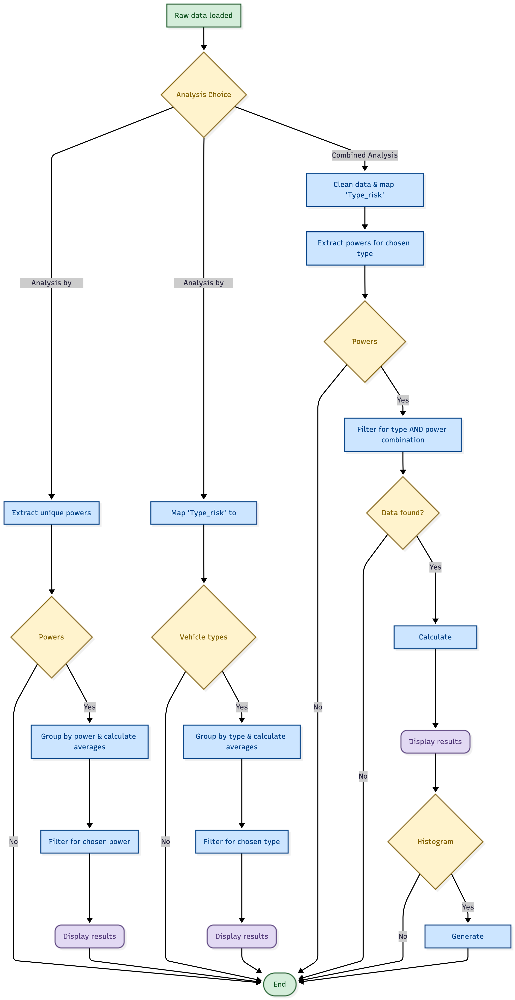

    
# Car Insurance Analysis Application

## README Summary

- [Description](#description)
- [Features](#features)
- [Dataset](#dataset)
- [Variable Descriptions](#variable-descriptions)
- [Installation and Usage](#installation-and-usage)
- [Data Diagram](#data-diagram)
- [Project Structure](#project-structure)
- [CI/CD](#ci-cd)
- [Team Members](#team-members)


## Description
This project was developed as part of the *Management of Digital Projects 2* course.  
It involves building an interactive Python application using **Streamlit** for exploring and analyzing a car insurance dataset.

to explore and analyze a car insurance dataset.

## Features

- Dataset: Motor Vehicle Insurance Data
- Features: interactive visualizations, filtering, basic statistical analysis
- Deployment: automated CI/CD with Docker

## Dataset

You can access the dataset [here](https://data.mendeley.com/datasets/5cxyb5fp4f/2?utm_source=search).  
Published on July 30, 2024, by Josep Lledo and Jose M. Pavià.
## Variable Descriptions

| **Variable**            | **Description** |
|--------------------------|-----------------|
| `id`                    | Unique customer identifier. |
| `date_start_contract`   | Start date of the insurance contract. |
| `date_last_renewal`     | Date of the last contract renewal. |
| `date_next_renewal`     | Scheduled date for the next renewal. |
| `date_birth`            | Policyholder’s date of birth. |
| `date_driving_licence`  | Date the driving license was obtained. |
| `distribution_channel`  | Insurance distribution channel (e.g., agency, online). |
| `seniority`             | Contract seniority (in years). |
| `policies_in_force`     | Number of currently active policies. |
| `max_policies`          | Maximum number of policies held by the customer. |
| `max_products`          | Maximum number of insurance products subscribed. |
| `lapse`                 | Indicator of policy cancellation or termination (yes/no). |
| `date_lapse`            | Cancellation date, if applicable. |
| `payment`               | Payment method for the policy (monthly, annual, etc.). |
| `premium`               | Insurance premium amount. |
| `cost_claims_year`      | Total cost of claims for the current year. |
| `n_claims_year`         | Number of claims reported this year. |
| `n_claims_history`      | Total number of historical claims. |
| `r_claims_history`      | Total amount reimbursed over the claim history. |
| `type_risk`             | Type of insured risk (e.g., automobile, housing). |
| `area`                  | Customer’s geographical area. |
| `second_driver`         | Indicator of a second driver. |
| `year_matriculation`    | Vehicle registration year. |
| `power`                 | Vehicle power (in horsepower). |
| `cylinder_capacity`     | Engine displacement (in cm³). |
| `value_vehicle`         | Estimated value of the vehicle. |
| `n_doors`               | Number of doors on the vehicle. |
| `type_fuel`             | Type of fuel used by the vehicle (gasoline, diesel, electric, etc.). |
| `length`                | Vehicle length (in meters or centimeters, depending on the unit). |
| `weight`                | Vehicle weight (in kg). |


## Installation and Usage


### Method : Using Python and uv

1. **Install Python 3.13**
    Download and install from [Python.org](https://www.python.org/)

2. **Install uv**
    Follow instructions at uv docs : https://docs.astral.sh/ub

3. **Clone the repository**
    ```bash
    git clone https://gitlab-mi.univ-reims.fr/fade0003/management-des-projets-digitaux-2.git
    ```


4. **Navigate to the project directory**
    ```bash
    cd management-des-projets-digitaux-2    
    ```

5. **Install dependencies**
    ```bash
    uv sync --frozen
    ```

6. **Run the app**

    ```bash
    uv run streamlit run main.py
    ```

## Flowchart



## Project Structure

```text


├── data/
│   ├── raw/                # Raw data
│   │   └── Motor_vehicle_insurance_data.csv
│   └── processed/          # Processed data
│       └── new_motor_vehicle_insurance_data.csv
├── docs/
│   └── flow.jpeg 
├── src/
│   ├── main.py             # Streamlit entry point
│   └── functions/
│       ├── __init__.py
│       ├── bivariate_analysis.py
│       ├── engineering.py
│       ├── load_data.py
│       ├── main_dashboard.py
│       ├── search_by_power.py
│       ├── search_by_type_and_power.py
│       ├── search_by_vehicle_type.py
│       ├── utils.py
│       ├── variable_analysis.py
│       └── dashboard.py    # Dashboard functions
├── tests/                  # Unit tests
│   ├── features/steps/
│   │   └── example.steps.py
│   │       
│   ├── test_bivariate_analysis.py      # Fix Ruff style issues
│   ├── test_example.py                 # Added dependencies and uv/docker functionalities
│   ├── test_load_data.py               # Fixed load data errors
│   ├── test_main_dashboard.py          # Fix Ruff style issues
│   ├── test_search_by_power.py         # Fix Ruff style issues
│   ├── test_search_by_type_and_power.py  # Fix Ruff style issues
│   ├── test_search_by_vehicle_type.py  # Fix Ruff style issues
│   └── test_variable_analysis.py       # Fix Ruff style issues
├── .dockerignore
├── .editorconfig
├── .gitignore
├── .gitlab-ci.yml
├── .python-version
├── Dockerfile
├── README.Docker.md
├── README.md
├── compose.yaml
├── pyproject.toml
├── requirements.txt
└── uv.lock

```

## CI/CD
The project uses GitLab CI/CD and Docker to automate:
- Dependency installation
- Unit tests execution
- Docker container build and deployment
- Requires 'uv' for pipeline jobs
The pipeline is defined in .gitlab-ci.yml


## Team Members

- Timothe Fadenipo: Data Owner (Owner)
- Matthis Arvois: Data Engineer (Maintainer)
- Nikita Pomozov: Data Gouvernance (Developer)
- Rezi Sabashvilli: Data Scientist (Developer)
- Idriss Jordan: Interface Designer (Developer)
- Cherfatou Koudou kimba: Data Analyst (Developer)

