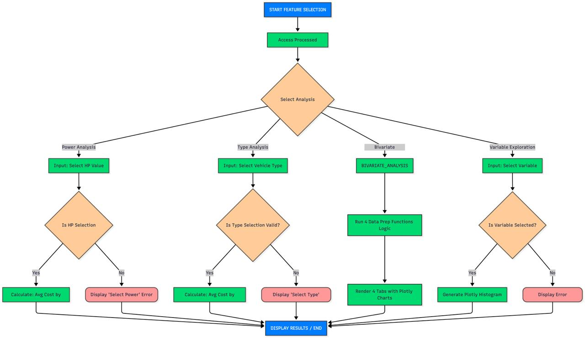

# Car Insurance Analysis Application

## README Summary

- [Description](#description)
- [Features](#features)
- [Dataset](#dataset)
- [Variable Descriptions](#variable-descriptions)
- [Installation and Usage](#installation-and-usage)
- [Data Diagram](#data-diagram)
- [Project Structure](#project-structure)
- [CI/CD](#ci-cd)
- [Team Members](#team-members)


## Description
This project is part of the Management of Digital Projects 2 course.
It consists of creating an interactive Python application using Streamlit


to explore and analyze a car insurance dataset.

## Features

- Dataset: Motor Vehicle Insurance Data
- Features: interactive visualizations, filtering, basic statistical analysis
- Deployment: automated CI/CD with Docker

## Dataset

You can access the dataset [here](https://data.mendeley.com/datasets/5cxyb5fp4f/2?utm_source=search).  
Published on July 30, 2024, by Josep Lledo and Jose M. Pavià.

## Variable Descriptions

- **id** : Identifiant unique du client.  
- **date_start_contract** : Date de début du contrat d’assurance.  
- **date_last_renewal** : Date du dernier renouvellement du contrat.  
- **date_next_renewal** : Date prévue pour le prochain renouvellement.  
- **date_birth** : Date de naissance du titulaire du contrat.  
- **date_driving_licence** : Date d’obtention du permis de conduire.  
- **distribution_channel** : Canal de distribution de l’assurance (ex. agence, en ligne).  
- **seniority** : Ancienneté du contrat (en années).  
- **policies_in_force** : Nombre de polices actives actuellement.  
- **max_policies** : Nombre maximum de polices détenues par le client.  
- **max_products** : Nombre maximum de produits d’assurance souscrits.  
- **lapse** : Indicateur de résiliation ou d’arrêt du contrat (oui/non).  
- **date_lapse** : Date de résiliation si applicable.  
- **payment** : Mode de paiement du contrat (mensuel, annuel, etc.).  
- **premium** : Montant de la prime d’assurance.  
- **cost_claims_year** : Coût total des sinistres pour l’année en cours.  
- **n_claims_year** : Nombre de sinistres déclarés cette année.  
- **n_claims_history** : Nombre total de sinistres historiques.  
- **r_claims_history** : Montant total des remboursements sur l’historique des sinistres.  
- **type_risk** : Type de risque assuré (ex. automobile, habitation).  
- **area** : Zone géographique du client.  
- **second_driver** : Indicateur de présence d’un second conducteur.  
- **year_matriculation** : Année d’immatriculation du véhicule.  
- **power** : Puissance du véhicule (en chevaux).  
- **cylinder_capacity** : Cylindrée du moteur (en cm³).  
- **value_vehicle** : Valeur estimée du véhicule.  
- **n_doors** : Nombre de portes du véhicule.  
- **type_fuel** : Type de carburant du véhicule (essence, diesel, électrique…).  
- **length** : Longueur du véhicule (en mètres ou cm selon l’unité).  
- **weight** : Poids du véhicule (en kg).  


## Installation and Usage


### Method : Using Python and uv

1. **Install Python 3.13**
    Download and install from [Python.org](https://www.python.org/)

2. **Install uv**
    Follow instructions at uv docs : https://docs.astral.sh/ub

3. **Clone the repository**
    ```bash
    git clone https://gitlab-mi.univ-reims.fr/fade0003/management-des-projets-digitaux-2.git
    ```

4. **Navigate to the project directory**
    ```bash
    cd management-des-projets-digitaux-2    
    ```


5. **Run the app**

    ```bash
    uv run streamlit run main.py
    ```

## Data flow diagramm



## Project Structure

```text

├── .venv/                  # Virtual environment
├── data/
│   ├── raw/                # Raw data
│   │   └── Motor_vehicle_insurance_data.csv
│   └── processed/          # Processed data
├── src/
│   ├── main.py             # Streamlit entry point
│   └── functions/
│       ├── __init__.py
│       └── dashboard.py    # Dashboard functions
├── tests/                  # Unit tests
│   └── test_example.py
├── .dockerignore
├── .editorconfig
├── .gitignore
├── .gitlab-ci.yml
├── .python-version
├── Dockerfile
├── README.Docker.md
├── README.md
├── compose.yaml
├── pyproject.toml
├── requirements.txt
└── uv.lock

```

## CI/CD
The project uses GitLab CI/CD and Docker to automate:
- Dependency installation
- Unit tests execution
- Docker container build and deployment
- Requires 'uv' for pipeline jobs
The pipeline is defined in .gitlab-ci.yml


## Team Members

- Timothe Fadenipo: Data Owner (Owner)
- Matthis Arvois: Data Engineer (Maintainer)
- Nikita Pomozov: Data Gouvernance (Developer)
- Rezi Sabashvilli: Data Scientist (Developer)
- Idriss Jordan: Interface Designer (Developer)
- Cherfatou KOUDOU KIMBA: Data Analyst (Developer)

